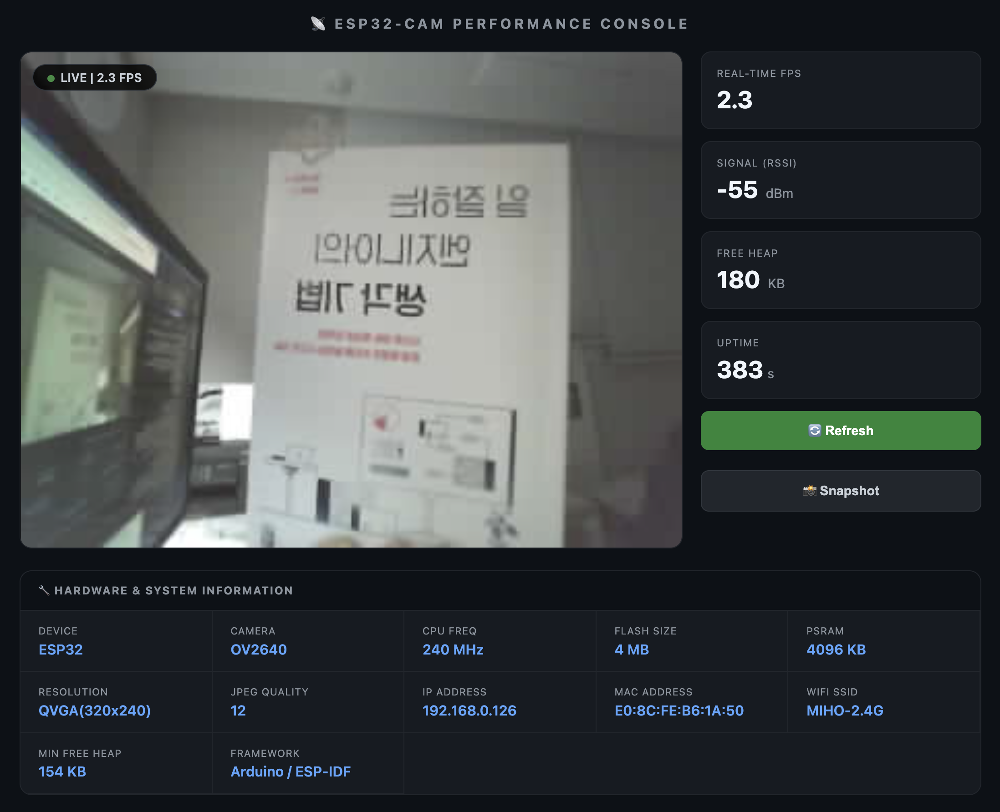

# 📡 ESP32-CAM Performance Console

> AI Thinker ESP32-CAM 모듈을 활용한 **실시간 스트리밍 + 시스템 대시보드** 프로젝트  
> PlatformIO + Arduino Framework 기반, 단일 포트(80) 완전 안정화 버전

---



---

## ✨ 주요 기능

| 기능 | 설명 |
|------|------|
| 🎥 실시간 영상 | JS fetch 폴링 방식 — cross-origin 문제 없이 100% 안정적 |
| 📊 실시간 대시보드 | FPS, 신호세기(RSSI), 여유 메모리, 업타임 1초 주기 갱신 |
| 🔧 장비 정보 패널 | 칩, CPU, Flash, PSRAM, IP/MAC, WiFi SSID 등 자동 표시 |
| 📸 스냅샷 | `/capture` 엔드포인트로 즉시 JPEG 다운로드 |
| ⚡ 단일 포트(80) | 포트 분리 없이 모든 기능 제공, 방화벽 이슈 없음 |

---

## 🛠 사용 하드웨어

| 항목 | 사양 |
|------|------|
| **보드** | AI Thinker ESP32-CAM |
| **MCU** | ESP32-D0WD (Dual Core, 240MHz) |
| **카메라** | OV2640 (최대 2MP) |
| **Flash** | 4MB SPI Flash |
| **PSRAM** | 4MB PSRAM (고속 프레임 버퍼) |
| **WiFi** | 802.11 b/g/n (2.4GHz) |
| **업로드** | USB-UART 어댑터 (FTDI / CH340) 필요 |

---

## 📦 소프트웨어 스택

| 항목 | 내용 |
|------|------|
| Build Tool | **PlatformIO** |
| Framework | **Arduino for ESP32** |
| Platform | `espressif32` |
| Board Target | `esp32cam` |
| Camera Library | `esp_camera.h` (ESP-IDF 내장) |
| HTTP Server | `esp_http_server.h` (ESP-IDF 내장) |

---

## 📁 프로젝트 구조

```
74_ESP32-CAM/
├── src/
│   └── esp32cam.cpp        # 메인 소스 (카메라, 서버, 스트리밍)
├── include/
│   └── secrets.h           # WiFi 인증 정보 ← Git 제외됨
├── platformio.ini          # PlatformIO 빌드 설정
├── screenshot.png          # 대시보드 스크린샷
└── README.md
```

---

## ⚙️ 카메라 핀 설정 (AI Thinker)

| 신호 | GPIO |
|------|------|
| PWDN | 32 |
| XCLK | 0 |
| SIOD | 26 |
| SIOC | 27 |
| Y2 ~ Y9 | 5, 18, 19, 21, 36, 39, 34, 35 |
| VSYNC | 25 |
| HREF | 23 |
| PCLK | 22 |

---

## 🔑 WiFi 설정

`include/secrets.h` 파일을 생성하고 아래 내용을 입력하세요:

```cpp
#define WIFI_SSID     "your_wifi_ssid"
#define WIFI_PASSWORD "your_wifi_password"
```

> ⚠️ `secrets.h`는 `.gitignore`에 포함되어 있어 저장소에 업로드되지 않습니다.

---

## 🚀 빌드 & 업로드

### 1. 사전 준비

- [PlatformIO](https://platformio.org/) 설치
- USB-UART 어댑터로 ESP32-CAM 연결
- 업로드 전 `IO0` 핀을 `GND`에 연결 (플래싱 모드 진입)

### 2. 포트 설정 (`platformio.ini`)

```ini
upload_port  = /dev/cu.usbserial-210   ; macOS
monitor_port = /dev/cu.usbserial-210
; Windows: COM3 등으로 변경
```

### 3. 빌드 & 업로드

```bash
# 빌드 + 업로드
pio run -t upload

# 시리얼 모니터 (업로드 완료 후 IO0-GND 연결 해제)
pio device monitor -b 115200
```

시리얼 모니터에 아래 메시지가 출력되면 성공입니다:
```
[OK] PSRAM:Found
http://192.168.x.x
[OK] HTTP server on port 80
```

---

## 🌐 웹 인터페이스

브라우저에서 시리얼 모니터에 출력된 IP로 접속합니다:

```
http://192.168.0.126
```

### API 엔드포인트 (포트 80)

| 경로 | 설명 |
|------|------|
| `GET /` | 대시보드 웹 페이지 |
| `GET /capture` | JPEG 정지 이미지 반환 (스트리밍에도 사용) |
| `GET /status` | 시스템 상태 JSON |

### `/status` 응답 예시

```json
{
  "rssi": -44,
  "heap": 163840,
  "uptime": 138,
  "chip": "ESP32",
  "cpu_mhz": 240,
  "flash_mb": 4,
  "psram_kb": 4096,
  "resolution": "QVGA(320x240)",
  "quality": 12,
  "ip": "192.168.0.126",
  "mac": "E0:8C:FE:B6:1A:50",
  "ssid": "MyWiFi",
  "min_heap": 130000
}
```

---

## 🏗 아키텍처 (V16)

```
┌─── HTTP Server (Port 80) ─────────────────────────────────┐
│  GET /           → 대시보드 HTML 반환                      │
│  GET /capture    → JPEG 1장 반환 (즉시 완료)               │
│  GET /status     → JSON 시스템 정보 반환 (즉시 완료)       │
└───────────────────────────────────────────────────────────┘
            ↑ 1초마다           ↑ 최대한 빠르게 반복
         /status 호출         /capture 반복 호출
            │                        │
┌─── Browser JavaScript ────────────────────────────────────┐
│  poll()       → RSSI, Heap, Uptime 갱신 (1초 주기)        │
│  captureLoop() → fetch('/capture') → Blob URL →  교체 │
│               → FPS 클라이언트 측 직접 계산               │
└───────────────────────────────────────────────────────────┘
```

**왜 JS 폴링 방식인가?**

| 방식 | 문제점 |
|------|--------|
| MJPEG (단일 포트 80) | httpd 블로킹 → 대시보드 먹통 |
| MJPEG (포트 81 분리) | 브라우저 cross-origin 정책으로 `` 렌더링 차단 |
| **JS `/capture` 폴링** ✅ | 동일 포트, 동일 출처, 완전 안정적 |

---

## 📐 카메라 설정

현재 설정 (PSRAM 있는 경우):

```cpp
cfg.frame_size   = FRAMESIZE_QVGA;  // 320 × 240
cfg.jpeg_quality = 12;              // 1(최고화질) ~ 63(최저화질)
cfg.fb_count     = 2;               // 더블 버퍼링
```

### FPS 가이드

| 해상도 | JPEG Quality | 예상 FPS |
|--------|-------------|---------|
| QQVGA (160×120) | 25 | ~10-15 FPS |
| QVGA (320×240) | 12 | **~5-8 FPS** ← 현재 |
| QVGA (320×240) | 50 | ~8-12 FPS (화질 저하) |

---

## 🐛 문제 해결

| 증상 | 원인 | 해결 |
|------|------|------|
| 업로드 안 됨 | IO0 핀이 GND에 미연결 | IO0-GND 연결 후 재시도 |
| 영상 검은 화면 | 이전 MJPEG 방식의 cross-origin 차단 | V16은 해결됨 (JS 폴링) |
| FPS 매우 낮음 | WiFi 신호 약함 또는 화질 설정 | AP 가까이 이동, `jpeg_quality` 값 올리기 |
| 대시보드 수치 0 | 이전 httpd 블로킹 문제 | V16은 해결됨 (단일 포트, 빠른 핸들러) |
| 카메라 초기화 실패 | 전원 불안정 또는 핀 오결선 | 5V 전원 확인, 핀 재확인 |

---

## 📝 버전 이력

| 버전 | 주요 변경 |
|------|---------|
| V16 | JS 폴링 스트리밍 도입, 단일 포트 완전 안정화 |
| V15 | Raw TCP MJPEG 서버 (포트 81) |
| V14 | httpd 이원화 (포트 80/81) |
| V12 | FreeRTOS 별도 스트리밍 태스크 |
| V1~V11 | MJPEG 단일 포트 최적화 반복 |

---

## 📄 라이선스

MIT License — 자유롭게 사용, 수정, 배포 가능합니다.

---

*Built with ❤️ using ESP32-CAM + PlatformIO + Arduino Framework*
